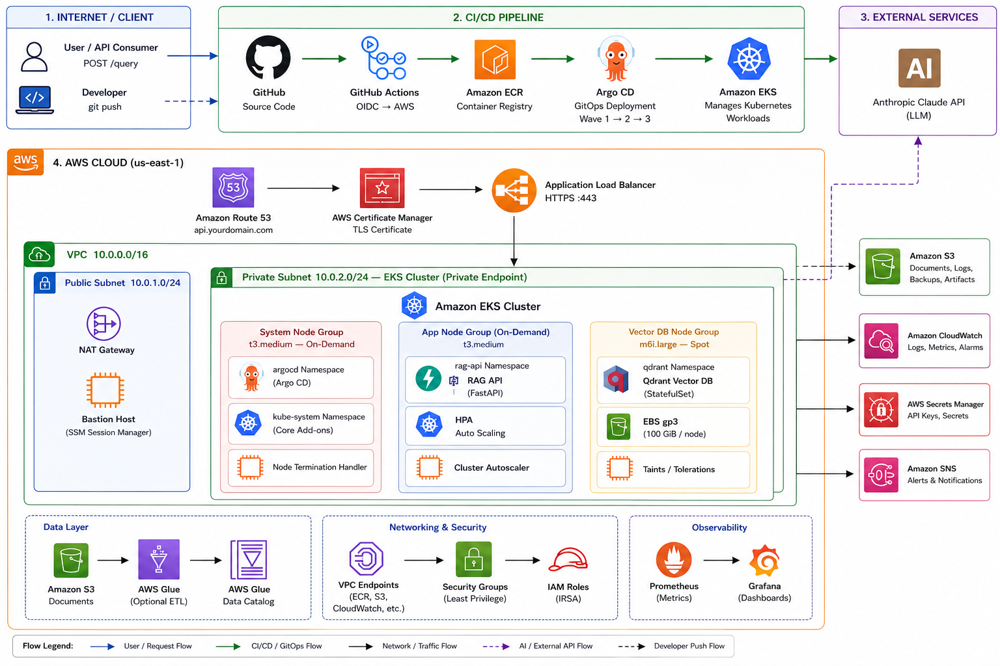

<div align="center">

# Production RAG Pipeline

[](https://github.com/Eaglewings966/rag-pipeline/actions/workflows/ci.yml)
[](https://kubernetes.io/)
[](https://www.terraform.io/)
[](https://www.python.org/)
[](https://aws.amazon.com/)

**A production-minded document intelligence platform: secure documents in, grounded answers out.**

S3 documents are chunked and embedded locally, stored in Qdrant, retrieved by a FastAPI service, and answered by Claude through LangChain. The surrounding platform handles the parts a demo usually skips: authentication, rate limits, private Kubernetes networking, GitOps, observability, and infrastructure as code.

[Architecture](#architecture) · [Quick start](#quick-start) · [Deployment](#aws-eks-deployment) · [Screenshots](#portfolio-screenshot-checklist)



</div>

---

## The problem

Most RAG examples stop after vector search and one LLM call. That is useful for learning, but it leaves the real operating questions unanswered: **who can call it, how is usage controlled, where do secrets live, how is it deployed, and what does each answer cost?**

This project is an end-to-end answer to those questions. It is a practical reference architecture for an AI infrastructure engineer building a document Q&A API that is observable, secure by default, and designed to evolve beyond a local proof of concept.

## What happens when someone asks a question?

1. A client sends `POST /query` using an API key over HTTPS.
2. Route 53, ACM, and the Application Load Balancer route the request into EKS.
3. `auth-service` validates the API key and optional IP allowlist.
4. `rate-limiter` applies a Redis-backed sliding-window limit (10 requests/minute per key).
5. `rag-api` embeds the question, retrieves relevant document chunks from Qdrant, and builds a grounded prompt.
6. LangChain sends the prompt to Claude (or OpenAI through one configuration change).
7. The API returns the answer, sources, timings, and usage metadata; Prometheus records the operational metrics.

## Architecture

The rendered diagram above is the quick visual tour. The complete implementation-level architecture is below.

~~~text
╔══════════════════════════════════════════════════════════════════════════════════╗
║                           INTERNET / CLIENT                                      ║
║                                                                                  ║
║   User / API Consumer                    Developer / CI Engineer                 ║
║   POST /query  GET /health               git push → GitHub Actions               ║
╚══════════════════╦═══════════════════════════════════╦═══════════════════════════╝
                   ║ HTTPS                             ║ OIDC Token
                   ▼                                   ▼
╔══════════════════════════════╗   ╔═══════════════════════════════════════════════╗
║      ROUTE 53 (DNS)          ║   ║            CI/CD PIPELINE                    ║
║  api.yourdomain.com          ║   ║                                               ║
║  → ALB static IP             ║   ║  GitHub Actions                               ║
╚══════════════╦═══════════════╝   ║  ├── Lint + Test                              ║
               ║                   ║  ├── Trivy security scan                      ║
               ▼                   ║  ├── Docker build                             ║
╔══════════════════════════════╗   ║  ├── Push → ECR                              ║
║   ACM CERTIFICATE            ║   ║  └── Argo CD sync trigger                    ║
║   TLS termination            ║   ║                                               ║
╚══════════════╦═══════════════╝   ║  GitHub OIDC → OIDC_ROLE_ARN (no static creds)║
               ║                   ╚══════════════════════╦════════════════════════╝
               ▼                                          ║
╔══════════════════════════════════════════════════════════════════════════════════╗
║  AWS REGION: us-east-1                                   Terraform provisions   ║
║                                                          all infrastructure below║
║  ╔════════════════════════════════════════════════════════════════════════════╗  ║
║  ║  VPC: 10.0.0.0/16                                                         ║  ║
║  ║                                                                            ║  ║
║  ║  ┌──────────────────────────┐    ┌──────────────────────────────────────┐  ║  ║
║  ║  │  PUBLIC SUBNET           │    │  PRIVATE SUBNET                      │  ║  ║
║  ║  │  10.0.1.0/24             │    │  10.0.2.0/24 (nodes)                 │  ║  ║
║  ║  │                          │    │  10.0.3.0/24 (pods)                  │  ║  ║
║  ║  │  ALB (HTTPS :443)        │    │                                      │  ║  ║
║  ║  │  NAT Gateway             │    │  ╔══════════════════════════════════╗ │  ║  ║
║  ║  │  Bastion (SSM only)      │    │  ║  EKS CLUSTER (private endpoint)  ║ │  ║  ║
║  ║  └──────────────────────────┘    │  ║  EKS 1.35 · VPC CNI · IRSA      ║ │  ║  ║
║  ║                                  │  ║                                  ║ │  ║  ║
║  ║                                  │  ║  ┌────────────────────────────┐  ║ │  ║  ║
║  ║                                  │  ║  │  SYSTEM NODE GROUP         │  ║ │  ║  ║
║  ║                                  │  ║  │  t3.medium · on-demand     │  ║ │  ║  ║
║  ║                                  │  ║  │                            │  ║ │  ║  ║
║  ║                                  │  ║  │  ns: argocd                │  ║ │  ║  ║
║  ║                                  │  ║  │  ├── ArgoCD Server         │  ║ │  ║  ║
║  ║                                  │  ║  │  ├── Repo Server           │  ║ │  ║  ║
║  ║                                  │  ║  │  └── Application Ctrl      │  ║ │  ║  ║
║  ║                                  │  ║  │                            │  ║ │  ║  ║
║  ║                                  │  ║  │  ns: monitoring            │  ║ │  ║  ║
║  ║                                  │  ║  │  ├── Prometheus            │  ║ │  ║  ║
║  ║                                  │  ║  │  ├── Grafana               │  ║ │  ║  ║
║  ║                                  │  ║  │  └── Alertmanager          │  ║ │  ║  ║
║  ║                                  │  ║  │                            │  ║ │  ║  ║
║  ║                                  │  ║  │  ns: linkerd               │  ║ │  ║  ║
║  ║                                  │  ║  │  ├── Control Plane         │  ║ │  ║  ║
║  ║                                  │  ║  │  └── mTLS auto-inject      │  ║ │  ║  ║
║  ║                                  │  ║  │                            │  ║ │  ║  ║
║  ║                                  │  ║  │  ns: cert-manager          │  ║ │  ║  ║
║  ║                                  │  ║  │  └── DNS-01 via Route53    │  ║ │  ║  ║
║  ║                                  │  ║  │                            │  ║ │  ║  ║
║  ║                                  │  ║  │  ns: external-secrets      │  ║ │  ║  ║
║  ║                                  │  ║  │  └── ESO + IRSA            │  ║ │  ║  ║
║  ║                                  │  ║  └────────────────────────────┘  ║ │  ║  ║
║  ║                                  │  ║                                  ║ │  ║  ║
║  ║                                  │  ║  ┌────────────────────────────┐  ║ │  ║  ║
║  ║                                  │  ║  │  APPLICATION NODE GROUP    │  ║ │  ║  ║
║  ║                                  │  ║  │  t3.large · Spot (min: 1)  │  ║ │  ║  ║
║  ║                                  │  ║  │                            │  ║ │  ║  ║
║  ║                                  │  ║  │  ns: rag-api               │  ║ │  ║  ║
║  ║                                  │  ║  │  ├── auth-service           │  ║ │  ║  ║
║  ║                                  │  ║  │  │   FastAPI · API key auth │  ║ │  ║  ║
║  ║                                  │  ║  │  │   IP allowlist           │  ║ │  ║  ║
║  ║                                  │  ║  │  ├── rate-limiter           │  ║ │  ║  ║
║  ║                                  │  ║  │  │   FastAPI + Redis        │  ║ │  ║  ║
║  ║                                  │  ║  │  │   10 req/min per key     │  ║ │  ║  ║
║  ║                                  │  ║  │  ├── rag-api (3 replicas)   │  ║ │  ║  ║
║  ║                                  │  ║  │  │   FastAPI · LangChain    │  ║ │  ║  ║
║  ║                                  │  ║  │  │   KEDA ScaledObject      │  ║ │  ║  ║
║  ║                                  │  ║  │  └── metrics-exporter       │  ║ │  ║  ║
║  ║                                  │  ║  │      Prometheus metrics     │  ║ │  ║  ║
║  ║                                  │  ║  │      token counts + latency │  ║ │  ║  ║
║  ║                                  │  ║  │                            │  ║ │  ║  ║
║  ║                                  │  ║  │  ns: qdrant                │  ║ │  ║  ║
║  ║                                  │  ║  │  └── Qdrant (StatefulSet)  │  ║ │  ║  ║
║  ║                                  │  ║  │      PVC → EBS gp3 20Gi   │  ║ │  ║  ║
║  ║                                  │  ║  │      REST :6333            │  ║ │  ║  ║
║  ║                                  │  ║  │      gRPC :6334            │  ║ │  ║  ║
║  ║                                  │  ║  │      KEDA ScaledObject     │  ║ │  ║  ║
║  ║                                  │  ║  └────────────────────────────┘  ║ │  ║  ║
║  ║                                  │  ╚══════════════════════════════════╝ │  ║  ║
║  ║                                  └──────────────────────────────────────┘  ║  ║
║  ║                                                                            ║  ║
║  ║  SUPPORTING AWS SERVICES                                                   ║  ║
║  ║  ┌──────────────┐ ┌──────────────┐ ┌──────────────┐ ┌──────────────────┐  ║  ║
║  ║  │ Secrets      │ │ ECR          │ │ S3           │ │ SNS              │  ║  ║
║  ║  │ Manager      │ │ Container    │ │ Document     │ │ emmaubani.dev    │  ║  ║
║  ║  │ API keys     │ │ Registry     │ │ ingestion    │ │ @gmail.com       │  ║  ║
║  ║  │ Claude key   │ │ rag-api img  │ │ store        │ │ drift alerts     │  ║  ║
║  ║  └──────────────┘ └──────────────┘ └──────────────┘ └──────────────────┘  ║  ║
║  ╚════════════════════════════════════════════════════════════════════════════╝  ║
╚══════════════════════════════════════════════════════════════════════════════════╝

EXTERNAL SERVICES
┌─────────────────────────────────────────────────────────┐
│  Claude API (claude-sonnet-4-6)  ←── rag-api pod        │
│  LangChain abstraction layer                            │
│  Provider-agnostic — swap to OpenAI with one env var    │
└─────────────────────────────────────────────────────────┘

REQUEST FLOW
User → Route53 → ALB (TLS) → Ingress → auth-service
     → rate-limiter → rag-api → Qdrant (vector search)
     → Claude API (generation) → response → User

DEPLOYMENT FLOW
Developer → GitHub → Actions (OIDC) → ECR → Argo CD
          → sync wave 1 (platform) → wave 2 (security)
          → wave 3 (rag-api) → EKS

TERRAFORM PROVISIONS
Terraform → VPC + subnets + NAT → EKS cluster
          → node groups → IAM/IRSA → ACM cert
          → Route53 records → ECR → S3 → Secrets Manager
          → SNS topic → DynamoDB (tf state lock)~~~

### Request and delivery paths

~~~text
Request path:    Client → Route 53 → ALB → Ingress → auth → rate limit → RAG API → Qdrant + Claude
Document path:   S3 → ingestion job → chunking + embeddings → Qdrant
Delivery path:   GitHub → Actions (OIDC) → ECR → Argo CD sync waves → EKS
Metrics path:    RAG services → Prometheus → Grafana / Alertmanager → SNS
~~~

## Production capabilities

| Area | What this project demonstrates |
|---|---|
| Retrieval | Local `all-MiniLM-L6-v2` embeddings, Qdrant cosine search, source attribution |
| Generation | Claude via LangChain; provider abstraction supports an OpenAI swap |
| Security | API keys, optional IP allowlist, rate limiting, Secrets Manager, IRSA, network policies, Linkerd mTLS |
| Infrastructure | Terraform-managed VPC, EKS, ECR, S3, IAM, Secrets Manager, SNS, DNS/TLS foundations |
| Delivery | GitHub Actions OIDC, image scanning, ECR publication, Argo CD GitOps sync waves |
| Scale | KEDA queue-depth trigger, HPA fallback, managed node groups, warm application capacity |
| Observability | Prometheus metrics, Grafana dashboards, latency, tokens, retrieval time, queue depth, and estimated cost |

## Tech stack

| Layer | Technologies |
|---|---|
| API and AI | Python 3.11, FastAPI, LangChain, Claude API, sentence-transformers |
| Retrieval | Qdrant, EBS gp3 persistent volumes, S3 document store |
| Kubernetes | Amazon EKS, Argo CD, Linkerd, KEDA, External Secrets Operator |
| Cloud | AWS VPC, ALB, ACM, Route 53, ECR, Secrets Manager, SNS, IAM/IRSA |
| Observability | kube-prometheus-stack, Prometheus, Grafana, Alertmanager |
| Delivery | Terraform, GitHub Actions, GitHub OIDC, Trivy |

## Repository map

~~~text
rag-pipeline/
├── .github/workflows/              # CI and GitOps delivery workflows
├── apps/
│   ├── rag-api/                    # Retrieval and generation API
│   ├── auth-service/               # API-key and IP validation
│   ├── rate-limiter/               # Redis sliding-window protection
│   ├── metrics-exporter/           # Prometheus-friendly RAG metrics
│   └── ingestion/                  # S3 → chunks → Qdrant pipeline
├── docs/
│   ├── architecture/               # PNG, Mermaid source, architecture notes
│   └── images/                     # Supporting project imagery
├── k8s/
│   ├── argocd/                     # App-of-Apps and sync waves
│   ├── autoscaling/                # KEDA and HPA resources
│   ├── deployments/                # API, auth, limiter, Qdrant workloads
│   ├── external-secrets/           # Secrets Manager integration
│   ├── monitoring/                 # Grafana dashboards
│   ├── namespaces/                 # Namespace and mesh labels
│   └── network-policies/           # Default-deny and explicit traffic paths
├── scripts/                        # Bootstrap, verification, teardown
├── terraform/                      # Cloud infrastructure and reusable modules
├── docker-compose.yml              # Local development stack
└── README.md
~~~

## Quick start

> Local mode is useful for API development. AWS credentials, an Anthropic key, and EKS are only needed for the cloud deployment path.

```bash
cd "C:\Projects\Production RAG Pipeline"
copy .env.example .env
# Add ANTHROPIC_API_KEY to .env

docker compose up --build
curl http://localhost:8000/health
```

For ingestion, upload supported `.pdf`, `.txt`, `.md`, or `.rst` documents to an S3 prefix, then run the ingestion workload with its S3 bucket and prefix.

## AWS EKS deployment

Before bootstrap, configure these environment-specific values. Never commit an actual API key or Terraform state credentials.

| Location | Configure |
|---|---|
| `terraform/versions.tf` | Terraform state bucket and DynamoDB lock table |
| `terraform/terraform.tfvars` | AWS region, CIDRs, sizing values, and alert email |
| `k8s/deployments/*.yaml` | AWS account ID, image tags, and IRSA role ARNs |
| GitHub repository secrets | AWS account ID, region, ECR repository, OIDC role ARN, and cluster name |

Create the state bucket and DynamoDB lock table first, then export the bucket name. The bootstrap script passes this value to Terraform, so `terraform/versions.tf` does not need to be edited:

```bash
export TFSTATE_BUCKET="your-unique-terraform-state-bucket"
bash scripts/bootstrap.sh
bash scripts/verify.sh
```

The bootstrap process asks for the Anthropic key without sending it to Terraform, provisions the infrastructure after plan confirmation, configures `kubectl`, installs the AWS Load Balancer Controller, Linkerd, KEDA, External Secrets Operator, kube-prometheus-stack, and Argo CD, then applies the application manifests.

The demo ingress provisions an internet-facing HTTP ALB and does not require Route 53 or ACM. After bootstrap, get its public DNS name with `kubectl get ingress -n rag-api`. For a real production domain, add ACM HTTPS and Route 53 records before exposing the API publicly.

## What to monitor

The Grafana dashboards are meant to answer four simple questions quickly:

- **Is the platform healthy?** Node capacity, pod health, replica count, errors.
- **Is it fast?** Request rate and p50/p95/p99 end-to-end and retrieval latency.
- **Is it useful?** Chunks retrieved and response/source behavior.
- **What is it costing?** Prompt tokens, completion tokens, total tokens, and estimated cost per hour.

## Portfolio screenshot checklist

Use these in a LinkedIn carousel, README update, or technical write-up:

1. The architecture image above — the project story in one slide.
2. `terraform output` showing the provisioned EKS, S3, ECR, and supporting resources.
3. Ingestion job logs proving document chunks were written to Qdrant.
4. A `POST /query` response showing the answer, source chunks, token usage, and timings.
5. Rate limiting: 10 allowed requests followed by a `429` response and `Retry-After` header.
6. Argo CD showing healthy applications and sync waves.
7. Grafana LLM metrics showing tokens/minute, cost/hour, latency, and queue depth.

## Safety and cleanup

This deployment creates billable AWS resources, including EKS, NAT Gateway, ALB, storage, and compute. Capture your screenshots first, then remove the stack:

```bash
bash scripts/destroy.sh
```

## Learning outcomes

By working through this repository, you practice more than RAG itself: running stateful vector workloads on Kubernetes, managing cloud secrets through IRSA, GitOps delivery, workload autoscaling, service-to-service security, and making LLM usage measurable in operational terms.

---

Built as a portfolio project for production AI infrastructure engineering.